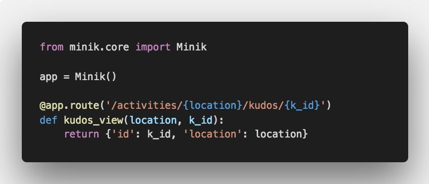

Minik: Serverless Web Framework
===============================

Using AWS lambda functions and API Gateway, minik will serve as the framework
that facilitates development in the serverless space.

Installing
**********

Install the latest release:

>>> pip install minik
✨🍰✨

Only **Python 3.6+** is supported.

Simple Example
**************

In it's most basic form; quite honestly, it's only form. This is how your lambda
function should look like:

.. code-block:: python

    from minik.core import Minik, BadRequestError

    app = Minik()

    @app.route('/hello/{name}')
    def hello_view(name):

        if name == 'FINDME':
            # Returns a 400 status code with the message as the body.
            raise BadRequestError(msg='This is not a supported name.')

        # A simple way of getting the current request as json.
        request_payload = app.request.json_body
        return {'hello': name}

HTTP Methods
************

With minik you can also specify the HTTP methods for a given view. If you don't
define the methods, by default, every single HTTP method will be allowed.

.. code-block:: python

    from minik.core import Minik

    app = Minik()

    @app.route('/events/{location}')
    def events_view(location):
        # This route will be invoked for GET, POST, PUT, DELETE... Any request.
        return {'data': ['granfondo MD', 'Silver Spring Century']}

    @app.route('/events', methods=['POST', 'PUT'])
    def create_event_view():
        create_event(app.request.json_body)
        return {'result': 'complete'}

Motivation
**********

The team behind this framework is adopting a very minimal set of features to enhance
and streamline web development in the serverless space. These were the business
needs that encouraged us to build minik:

- As a developer I need to have the ability to write an API using a syntax I'm
  familiar with (flask like) in the AWS ecosystem.
- As a developer I want to decide how to build and deploy my lambda functions. I do
  not want my framework to dictate these processes for me. I want to own them!
- As a developer when installing my framework, I only want to get the framework.
  I don't want to any aditional tooling, any aditional process based workflows.
- When using the microframework I am aware that I am responsible for the configuration
  required to associate my lambda function to its enpoints.

The features of this library should be absolutely driven by a very specific
business need. So far, the minimal approach has been sufficient for our team to
write and expose and API using AWS services.

Just the framework
******************

Things to be aware of when working using minik:

- When used in your lambda function, you're responsible of including the source
  code of minik in your .zip artifact. For packaging purposes we recommend using
  `Juniper`_.
- Unlike other frameworks like `Flask` or `Django` where using the decorator is
  sufficient to define the routes of the web app. In minik, you're responsible for
  linking a lambda function to a the API gateway. We recommend using a `SAM`_ template.
- There is not local development server! For testing purposes, deploy the lambda
  in AWS! There's no excuse not to. Use `sam package` and `sam deploy` for deployment
  purposes.

.. _Juniper: https://github.com/eabglobal/juniper
.. _SAM: https://aws.amazon.com/serverless/sam/

Contributing
************

For guidance on setting up a development environment and how to make a
contribution to Minik, see the `contributing guidelines`_.

.. _contributing guidelines: https://github.com/eabglobal/minik/blob/master/CONTRIBUTING.rst

Links
*****

* Documentation: https://eabglobal.github.io/minik/
* License: `Apache Software License`_

* Code: https://github.com/eabglobal/minik
* Issue tracker: https://github.com/eabglobal/minik/issues
* Test status:

  * Linux, Mac: https://circleci.com/gh/eabglobal/minik

.. _Apache Software License: https://github.com/eabglobal/minik/blob/master/LICENSE
